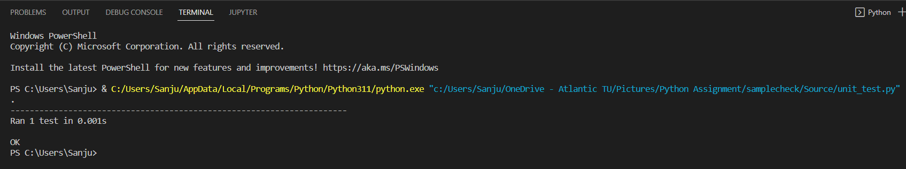

# Device Information Detailed-Overview

## Table of Contents

 

**[Description](#description)** 

**[Functionalities](#functionalities)** 

**[Overview](#overview)** 

**[Unit Testing](#unit-testing)** 

**[To Do](#to-do)** 

**[Authors](#authors)** 

## Description

This is a python program that is used to retrive the mac address, ip address, hostname and vendor name from the dhcp log file named **dhcpd.log** under the main directory "Samplecheck".

## Functionalities

| Script   |      Usage      |
|----------| :---------------|
|name.bat| A batch file named "name" is being created with refernce to lectures notes[], and once the command is being executed folders under the "Sample Check" directory such as "Documentation","Example","Sources","Tests" are being created as sub directories.
|main.py| Python file named **main.py** is then being executed for the sorting out mac address, ip address, host name and vendor name from the dhcp log file and the extracted result is stored on to a csv file.
|csv_file.py| This python script is located under the "Source" directory and defines the characteristics of the final sorted list exported in Microsoft Excel format with the required mac address, ip address, hostname and vendor name.
|unit_test.py| Unit test is then being perfomed on the python program with Test Cases inorder to validate the consistency of each unit on the program

## Overview ##

This section briefs how the code is being executed. At first an empty list is being set as "my_host". "oui_id" is an dictionary with a key value pair of mac adress and their associated vendor name. Four empty list is then being defined named "ipaddr" "mac" "vend" "hname" and this stores the ip address, mac address, vendor name and host name in this list. csv file is created into a directory named "nodes.csv" .The standalone script is then being called and the dhcpd log file is being read. Line 28 on the program defines reading the dhcpd file with the command "r". Using for loop the log file is then iterated and on each line from the 34th part onwards the dhcpd log file is split using the command ".split()" .Next from the extracted part lines with words as "DHCPACK" and "ON" and the bracket is being removed of from the line. The ip adress from the above mentioned extracted line is stored on a variable named "ipv4". Further from the extracted line the mac address part is being made to uppercase letters and stored in a variable named "mac_address". The first six alphanumeric values from the mac address is then being extracted using the strip function "[0:8]" and stored in a variable named "oui". Next on line 40 the extracted mac address after perfoming strip function is being is compared on to the dictonary key value pairs "oui_id" and if the details are present it is then stored on "vendor_values" . A if loop is then being executed to check if the host was previously identified and if identified "pass" command is executed (nothing is done), if host not found then the new host is being added to "my_hosts" lists. Ip address, mac address, vendor adddress is then being appended/inserted into the earlier created lists. From the extracted log dhcp log file without paranthesis host name is being checked line 50 of program **main.py** and converted to upper case alphabets. An if loop is then being exectuted to detect hostname with "VIA" in the dhcp extracted log file and is saved as "No Hostname" in the final retrieved csv file. On line 52 the hostname variable is then appended to the earlier created list named "hname" and the final extracted list of device information is stored in "host_list" file. The opened dhcpd log file is closed and the extracted list is exported to a csv file name "nodes.csv"

## Unit Testing ##

Unit testing had been perfomed on the python program, the code executed is placed under the "Source" directory named **unit_test.py** and the output below suggests that the test result was successful.

## Authors ##

Device information project was developed by Sanju Abraham Varughese as a part of practical assessment on module Infrastructure as Code - MSc Cloud Technologies.