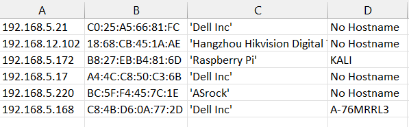

# Device Information Overview

 

## Table of Contents

**[Description](#description)**<br>

**[Requirements](#requirements)**<br>

**[Tested On](#tested-on)**<br>

**[Sample Execution](#sample-execution)**<br>

**[Output](#output)**<br>

**[Functionalities](#functionalities)**<br>

**[Authors](#authors)**<br>

 

# Description

This is a python program that is used to generate the mac address, ip address, hostname and vendor name from the dhcp log file provided. The sorted details are then exported to a csv file.

 

# Requirements

- Operating System : > Windows-11 Home Edition

- Python :  > Version 3.11.0

 

# Tested On

 

Windows 11 Home Edition - Build Version 10.0.22000 - Python version 3.11.0

 

# Sample Execution

 

Go to the project directory and run below command :

```

python main.py

```

 

# Output

 

The execution of command on project directory triggers the generation csv file "nodes.csv" which contains the  below details of the final sorted devices:

- Ip Address

- MAC Address

- Vendor Name

- Host Name

 



 

# Functionalities

 

| Script   |      Usage      |
|----------| :---------------|
| name.bat | Batch file to create project directories
| main.py |  To open, extract details from dhcp log file and exporting the sorted details to csv file
| csv_file.py | To create csv file for displaying the final sorted result
| unit_test.py | To perform unit testing on the python program

  

# Authors

 

Device information project was developed by Sanju Abraham Varughese as a part of practical assessment on module Infrastructure as Code - MSc Cloud Technologies.
